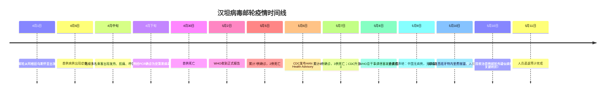

# 事件分析：邮轮汉坦病毒安第斯毒株疫情

> 2026年5月11日 | 🔒 内部参考 · 请勿外传  
> 事件级别：🟡 局部高风险 · 全球扩散风险低  
> 分析框架：病原特征 → 事件时间线 → 全球响应 → 投资影响

---

## 一、事件概要

2026年5月初，一艘极地探险邮轮「宏迪斯号」（MV Hondius）暴发汉坦病毒安第斯毒株（Andes virus）聚集性感染。这是**近30年来首次在封闭邮轮环境中确认的汉坦病毒人际传播事件**。WHO、美国CDC、欧盟ECDC已相继启动应急响应。

| 关键数字 | |
|---------|------|
| 涉事船只 | MV Hondius（荷兰籍极地探险邮轮） |
| 船上人员 | ~150人（乘客+船员） |
| 发病数 | 8人确诊 |
| 死亡数 | **3人**（病死率37.5%） |
| 行程 | 4月1日阿根廷出发 → 南极海域往返 |
| WHO接报 | 5月2日 |
| CDC响应级别 | **Level 3**（最高紧急响应） |
| 中疾控评估 | 国内无病例，无该毒株自然宿主分布 |

---

## 二、病原学：安第斯病毒 vs 其他汉坦病毒

汉坦病毒（Hantavirus）是一组由啮齿动物携带的RNA病毒，感染后可引起两种严重疾病：**肾综合征出血热（HFRS）** 和 **汉坦病毒肺综合征（HPS）**。安第斯病毒属于后者，病死率高达30%-50%。

| 特征 | 安第斯病毒（本次疫情） | 其他汉坦病毒 |
|------|:---:|:---:|
| 主要地理分布 | 南美洲（阿根廷、智利安第斯山区） | 亚洲、欧洲、北美 |
| 自然宿主 | 长尾稻鼠（Oligoryzomys longicaudatus） | 黑线姬鼠、褐家鼠等 |
| 能否人传人 | **是，唯一确认可人际传播的汉坦病毒** | 否 |
| 传播途径 | 吸入含病毒气溶胶 + 密切接触飞沫 | 仅吸入气溶胶 |
| 病死率 | 30-50% | 1-15%（HFRS） |
| 潜伏期 | 1-6周（平均2-3周） | 1-8周 |
| 疫苗 | **无**（全球已逾30年无有效疫苗） | 中国有汉滩病毒疫苗（不覆盖安第斯毒株） |
| 特效药 | 无，仅支持治疗 | 利巴韦林早期使用有一定效果 |

⚠ **为何本次疫情引发高度关注**：安第斯病毒是汉坦病毒中唯一确认可人传人的毒株。此前的人际传播仅限于家庭密切接触和医疗场景。本次邮轮环境提供了**封闭空间+长时间共处**的条件，是首次在群体聚集场景下确认传播。

---

## 三、事件时间线

### 关键转折点：首例邮轮外疑似病例

5月10日，荷兰一家医院收治了一例**非邮轮乘客的汉坦病毒疑似病例**。如果确认，将意味着：
- 病毒已从邮轮封闭环境**溢出至社区**
- 密切接触者的二次传播链可能已经形成
- 全球响应级别可能需要进一步升级

目前该病例仍在调查中，尚未正式确诊。

---

## 四、全球响应态势

| 机构 | 响应级别 | 核心行动 |
|------|:---:|---------|
| **WHO** | 密切监测，未宣布PHEIC | 发布全球预警，协调多国追踪接触者 |
| **美国CDC** | **Level 3**（最高） | 发布HAN Health Advisory；追踪返美乘客 |
| **欧盟ECDC** | 启动应急 | 西班牙、荷兰、德国联合追踪 |
| **中国CDC** | 常规监测 | 5月9日声明：无感染病例，无该毒株宿主分布 |
| **西班牙** | 国家响应 | 接收邮轮，组织人员遣返 |
| **荷兰** | 国家响应 | 收治疑似溢出病例 |

### WHO评估

WHO强调：
1. **全球公众风险仍为"低"**——汉坦病毒不易在人际间广泛传播
2. 与COVID-19不同，汉坦病毒的R₀值远低于1（每个感染者传播<1人）
3. 安第斯病毒的人际传播主要通过**密切和长时间接触**发生
4. 本次疫情更可能是一个**局部高后果事件**，而非大流行的前兆

---

## 五、与COVID-19的对比：为什么这次可能不是"下一个"

| 维度 | COVID-19 (2020) | 汉坦病毒邮轮疫情 (2026) |
|------|:---:|:---:|
| 病原体 | SARS-CoV-2（冠状病毒） | Andes virus（汉坦病毒） |
| R₀ | 2-3（高传染性） | <1（人际传播效率极低） |
| 传播方式 | 飞沫/气溶胶/接触（高效） | 密切接触气溶胶（低效） |
| 无症状传播 | 是（造成防控困难） | 否（仅症状期传播） |
| 潜伏期 | 2-14天 | 1-6周（不利于快速扩散） |
| 全球大流行潜力 | **高** | **极低** |
| 疫苗研发难度 | 相对容易（刺突蛋白靶点明确） | 困难（30年来无成功疫苗） |

⚠ 但有一个因素不能被忽视：**美国已退出WHO**，CDC预算被大幅削减。这意味着全球公共卫生应急体系的协调能力相比2020年**显著下降**。一旦出现更严重的病原体，响应速度可能更慢。

---

## 六、投资影响分析

### 结论：直接冲击有限，但催化生物安全/公共卫生板块重估

本次汉坦病毒疫情**不太可能**演变为全球大流行。但对市场的影响体现在以下几个方面：

### 6.1 直接受益方向

| 方向 | 逻辑 | 相关标的（非推荐） |
|------|------|------|
| **疫苗/生物技术** | 汉坦疫苗30年空白→各国可能加大投入 | 智飞生物、沃森生物、康希诺 |
| **抗病毒药物** | 利巴韦林/广谱抗病毒药短期需求 | 以岭药业（连花清瘟历史映射） |
| **体外诊断** | 汉坦病毒检测试剂盒紧急需求 | 圣湘生物、之江生物、达安基因 |
| **公共卫生信息化** | 疫情监测系统升级需求 | 卫宁健康、创业慧康 |
| **防护用品** | 应急储备和防护意识提升 | 英科医疗、蓝帆医疗 |

### 6.2 可能承压方向

| 方向 | 逻辑 |
|------|------|
| **邮轮/旅游** | 短期情绪压制，类似钻石公主号事件 |
| **航空** | 跨国旅行恐惧情绪 |

### 6.3 对现有股票池的影响

- **迈瑞医疗**（脑机接口赛道·器械龙头）：若全球公共卫生投入增加，监护仪/呼吸机/IVD需求受益
- **联影医疗**（脑机接口赛道·影像替代）：公共卫生基础设施投入增加
- **整体医疗板块**：疫情事件会提升医疗板块的关注度和资金流入

### 6.4 需警惕的情景

| 情景 | 概率 | 市场影响 |
|------|:---:|---------|
| 疫情局限于邮轮+密接者（>80%） | **高** | 市场基本忽视，生物安全概念脉冲一日游 |
| 荷兰疑似病例确认→多国出现零星病例（10-15%） | **中低** | 医疗板块持续活跃，旅游航空受短期压制 |
| 病毒发生适应性突变→R₀显著提升（<1%） | **极低** | 全球风险资产大跌，类似2020年2月情景 |

---

## 七、结论

1. **病原层面**：汉坦病毒安第斯毒株的病死率极高（37.5%），但人际传播效率极低（R₀<1），**不具备全球大流行的生物学基础**。

2. **疫情层面**：当前疫情很可能已经得到控制——邮轮已抛锚、人员已隔离、接触者追踪正在进行。周末出现的荷兰疑似病例是关键监测信号，但目前尚未确认。

3. **投资层面**：短期对市场影响有限，医疗板块可能出现情绪驱动的交易机会，但不建议基于此事件大幅调整持仓。真正的投资含义是：**全球生物安全基础设施长期投入不足，这一叙事会因每次疫情事件而强化**。

4. **对个人生活的建议**：出国旅行避免接触啮齿动物及其排泄物；前往南美洲安第斯山区需额外注意。

---

*本报告基于2026年5月11日公开信息编制。数据来源：WHO · CDC · ECDC · 中国疾控中心 · 国家疾控局 · The Guardian · Politico · CIDRAP。*  
*内部投研参考，不构成投资建议。*
